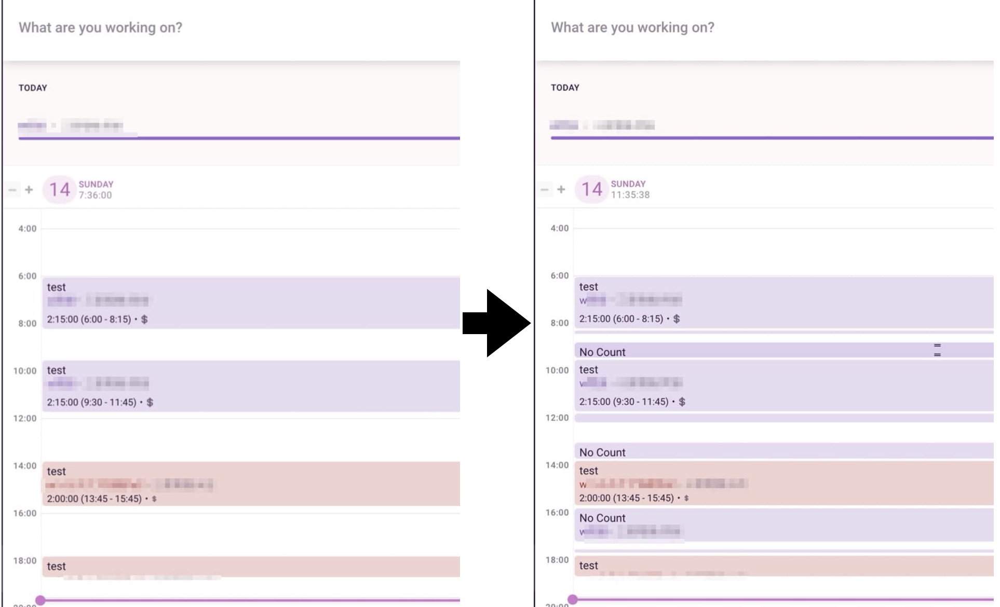
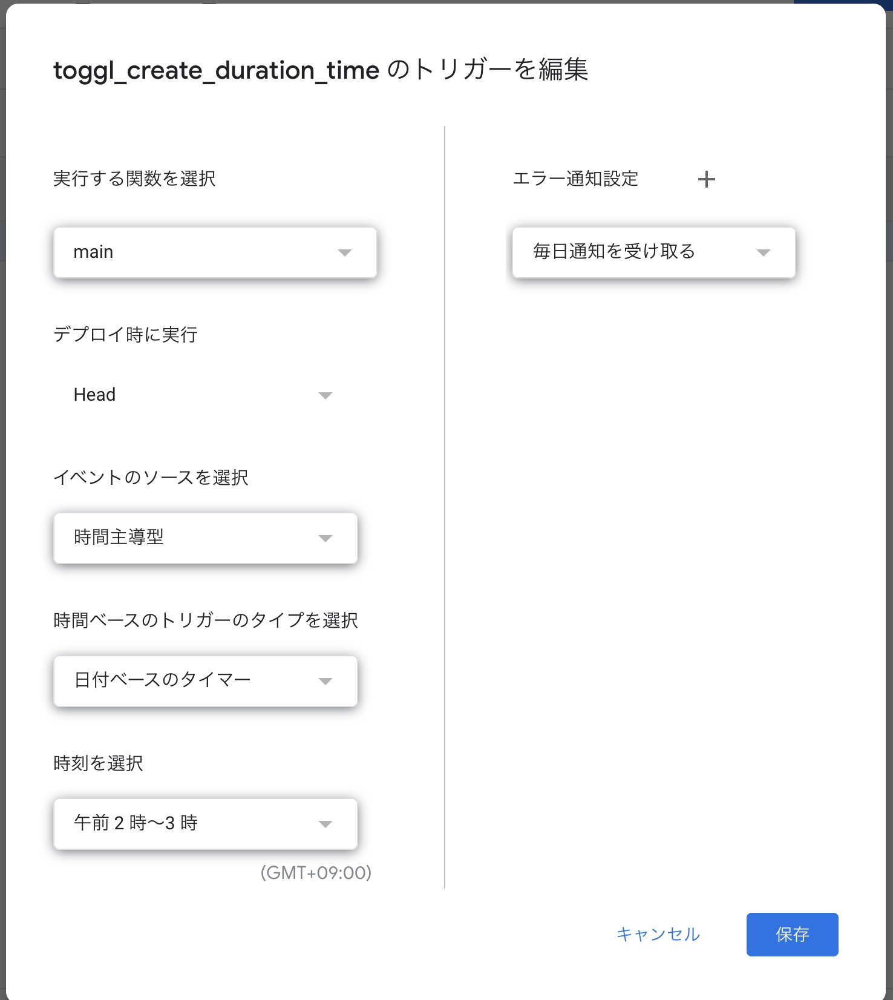

# Gas Toggl Create Duration Time

togglの空白の時間帯を特定の作業内容で埋めてくれるGASアプリケーション
考えられるユースケースは、仕事中に、測定していなかった時間帯にNo Countを示す作業内容で埋めている
## Demo

- 左側が、GASプログラムを実行する前
- 右側が、GASプログラムを実行した後


## Features

- togglで計測していない時間を特定の作業内容で埋めることができる
- GASアプリケーション内からToggle のapiを実行している

> [togglの公式のapi doc](https://github.com/toggl/toggl_api_docs)を参照

## Usage

```bash
$ git clone this repository
$ cd gas_toggl_create_duration_time
$ clasp create
```
change `.clasp.json`
```json
{
    "scriptId":"your scriptID",
    "rootDir":"./src"
}

"rootDir":"./src"
```

自身の環境に応じて、残りの設定を行う

### 空白時間を埋めたいプロジェクト・クライアントの取得する

`./src/togglutils.js`77行目を変更する

- 仕事のデータのみを取りたい場合は何かしらのフィルタリング処理を行う
- 例として、clientの名前に〇〇会社とあれば、

```bash
//仕事中のデータを抽出するためにフィルタリングする
if (data.client.indexOf("〇〇会社") != -1) {
    work_data.push(data)
}
```

### 空白の時間の`description`と`pid`の設定を行う

duration time（カウントしていなかったデータの`description`と`pid`を設定する

`./src/main.js`16,17行目を修正する

```bash
i_description = "No Count"
pid = "xxxxxxxx"

```

### toggl apiのtokenを設定する

toggl apiのtokenを設定を行う

`./src/main.js`の5行目

```bash
var TOGGL_BASIC_AUTH = 'yourtogglapi';
```


### 休憩時間の設定を行う

`./src/utils.gs.js`の1行目から14行目

以下の例は、8:30-8:45,12:15-13:00,17:15-17:30が休憩時間である

```bash
var rest_time_list = [
{
    "start": new Date(startDateTime.getFullYear(), startDateTime.getMonth(), startDateTime.getDate(), 8, 30, 0),
    "end": new Date(startDateTime.getFullYear(), startDateTime.getMonth(), startDateTime.getDate(), 8, 45, 0)
},
{
    "start": new Date(startDateTime.getFullYear(), startDateTime.getMonth(), startDateTime.getDate(), 12, 15, 0),
    "end": new Date(startDateTime.getFullYear(), startDateTime.getMonth(), startDateTime.getDate(), 13, 0, 0)
},
{
    "start": new Date(startDateTime.getFullYear(), startDateTime.getMonth(), startDateTime.getDate(), 17, 15, 0),
    "end": new Date(startDateTime.getFullYear(), startDateTime.getMonth(), startDateTime.getDate(), 17, 30, 0)
},
]
```

### 定期実行の設定

GASPのトリガーを設定する



`./src/main.js`の`main()`を定期実行

## Author
- [blog](https://akirano-blog.com)

## License

[LICENSE](./LICENSE.md)
